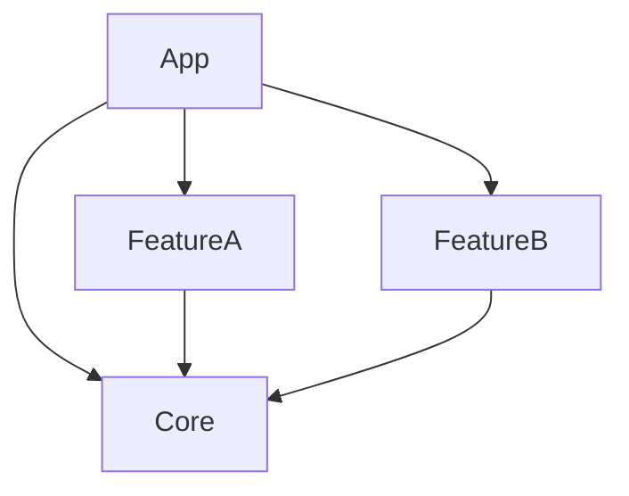

# PackageToTuistProject

Automatically generate Tuist `Project.swift` files from your existing Swift packages.

## The Problem

You have a monorepo with an app that depends on local Swift packages:



You want to migrate to [Tuist](https://tuist.dev), but each package needs a hand-written `Project.swift` — with the right targets, inter-package dependencies, platform filters, build settings, resources, and swift settings all wired up correctly. For a handful of packages that's tedious; for dozens it's error-prone.

**PackageToTuistProject** reads every `Package.swift` under a root directory, resolves the full dependency graph (including sibling-package references), and writes correct `Project.swift` files so you don't have to.

## Quick Start

```bash
swift build
PackageToTuistProject ./Packages
```

That's it — every package under `./Packages` gets a generated `Project.swift`.

## Options

| Option | Description | Default |
|--------|-------------|---------|
| `--platform` | Filter to specific platforms (repeatable). Values: `ios`, `macos`, `tvos`, `watchos`, `visionos` | all |
| `--bundle-id-prefix` | Bundle ID prefix for generated targets | `com.example` |
| `--product-type` | Product type: `staticFramework`, `framework`, `staticLibrary` | `staticFramework` |
| `--tuist-dir` | Path to Tuist directory for dependency validation | auto-detected |
| `--dry-run` | Preview changes without writing files | `false` |
| `--verbose`, `-v` | Enable verbose output | `false` |
| `--force` | Regenerate all files, ignoring timestamps | `false` |
| `--strict-deps` | Fail with a non-zero exit code if dependency validation finds issues | `false` |

## Conversion Mapping

| SPM | Tuist |
|-----|-------|
| `.target()` | `.target(product: .staticFramework)` |
| `.testTarget()` | `.target(product: .unitTests)` |
| `.executableTarget()` | Skipped |
| `.package(path: "../Sibling")` | `.project(target:path:)` |
| `.package(url: "...")` | `.external(name:)` |

## External Dependency Validation

The tool validates external dependencies against your existing `Tuist/Package.swift` and warns if any are missing:

```
⚠️  External dependency warnings:

Missing dependencies in Tuist/Package.swift:
Add the following to your dependencies array:

    .package(url: "https://github.com/example/lib", from: "1.0.0"),
```

Use `--strict-deps` to turn these warnings into hard failures (useful in CI).

## What Gets Generated

<details>
<summary>Example <code>Project.swift</code> output</summary>

```swift
// swiftlint:disable:this file_name
// swiftlint:disable all
// swift-format-ignore-file
// swiftformat:disable all
//
// Generated by PackageToTuistProject
import ProjectDescription

let project = Project(
    name: "Core",
    options: .options(
        disableSynthesizedResourceAccessors: true
    ),
    targets: [
        .target(
            name: "Core",
            destinations: [.iPad, .iPhone, .mac],
            product: .staticFramework,
            bundleId: "com.example.Core",
            sources: ["Sources/Core/**"],
            resources: [
                "Sources/Core/**/*.xcassets",
                "Sources/Core/**/*.strings",
                "Sources/Core/Resources/**"
            ],
            dependencies: [
                .external(name: "SomeLibrary")
            ],
            settings: .settings(base: [
                "OTHER_SWIFT_FLAGS": ["-package-name", "Core"],
                "SWIFT_PACKAGE_NAME": "Core",
                "SWIFT_ACTIVE_COMPILATION_CONDITIONS": "$(inherited) SWIFT_PACKAGE"
            ])
        ),
        .target(
            name: "CoreTests",
            destinations: [.iPad, .iPhone, .mac],
            product: .unitTests,
            bundleId: "com.example.CoreTests",
            sources: ["Tests/CoreTests/**"],
            dependencies: [
                .target(name: "Core")
            ],
            settings: .settings(base: [
                "OTHER_SWIFT_FLAGS": ["-package-name", "Core"],
                "OTHER_LDFLAGS": ["-ObjC"]
            ])
        )
    ]
)
// swiftformat:enable all
// swiftlint:enable all
```

</details>
