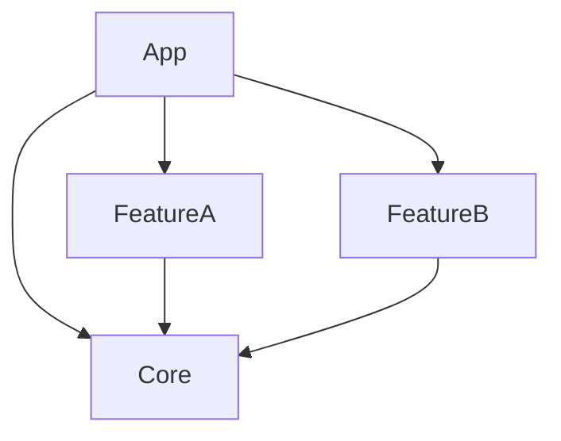

# PackageToTuistProject

Generate Tuist `Project.swift` files from your existing Swift packages.

## The Problem

You have a monorepo with an app that depends on local Swift packages:



Migrating to [Tuist](https://tuist.dev) means hand-writing a `Project.swift` for each package and keeping it in sync. PackageToTuistProject walks every `Package.swift` under a root directory, resolves the full dependency graph, and writes the `Project.swift` files for you.

## Who is this for?

Teams with an SPM-native modular monorepo who want to **evaluate** Tuist on a realistic project, or **adopt** it while keeping `Package.swift` as the source of truth. Either way, you stay SPM-native day-to-day and let Tuist consume the generated output — no parallel manifest to maintain.

## Quick Start

```bash
swift build
PackageToTuistProject ./Packages
```

Every package under `./Packages` gets a generated `Project.swift`.

## Options

| Option | Description | Default |
|--------|-------------|---------|
| `--platform` | Filter to specific platforms (repeatable). Values: `ios`, `macos`, `tvos`, `watchos`, `visionos` | all |
| `--bundle-id-prefix` | Bundle ID prefix for generated targets | `com.example` |
| `--product-type` | Product type: `staticFramework`, `framework`, `staticLibrary` | `staticFramework` |
| `--tuist-dir` | Path to Tuist directory for dependency validation | auto-detected |
| `--dry-run` | Preview changes without writing files | `false` |
| `--verbose`, `-v` | Enable verbose output | `false` |
| `--force` | Regenerate all files, ignoring timestamps | `false` |
| `--strict-deps` | Fail with a non-zero exit code if dependency validation finds issues | `false` |
| `--buildable-folders` | Emit Tuist `buildableFolders` instead of `sources`/`resources` globs. Requires Tuist ≥ [4.195.3](https://github.com/tuist/tuist/releases/tag/4.195.3). | `false` |

## Buildable Folders

`--buildable-folders` emits Tuist `buildableFolders` instead of `sources`/`resources` globs — the same membership model Xcode and SwiftPM already use, so adding or removing files doesn't require regeneration and the output stays closer to the `Package.swift` it came from. Opt-in today; expected to become the default in 1.0.

## External Dependency Validation

The tool checks external dependencies against your `Tuist/Package.swift` and warns about anything missing. Use `--strict-deps` to turn warnings into hard failures in CI.
